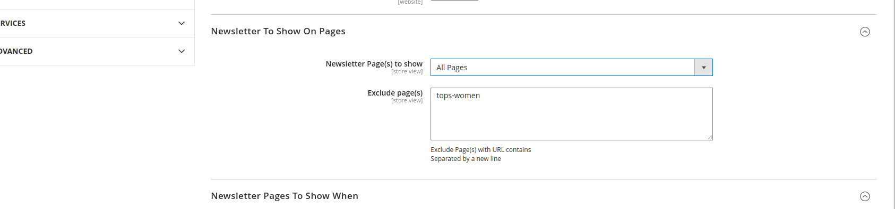

# Mage2 Module Bluethink Newsletter Popup

    ``bluethinkinc/module-newsletterpopup``

 - [Main Functionalities](#markdown-header-main-functionalities)
 - [Installation](#markdown-header-installation)
 - [Configuration](#markdown-header-configuration)
 - [Specifications](#markdown-header-specifications)

## Main Functionalities
Newsletter Popup show on pages

## Installation
\* = in production please use the `--keep-generated` option

### Type 1: Zip file

 - Unzip the zip file in `app/code/Bluethinkinc`
 - Enable the module by running `php bin/magento module:enable Bluethinkinc_NewsletterPopup`
 - Apply database updates by running `php bin/magento setup:upgrade`
 - Compilation by running `php bin/magento setup:di:compile`
 - Static content deploy by running `php bin/magento setup:static-content:deploy`
 - Flush the cache by running `php bin/magento cache:flush`

### Type 2: Composer

 - Make the module available in a composer repository for example:
    - private repository `repo.magento.com`
    - public repository `packagist.org`
    - public github repository as vcs
 - Add the composer repository to the configuration by running `composer config repositories.repo.magento.com composer https://repo.magento.com/`
 - Install the module composer by running `composer require bluethinkinc/module-newsletterpopup`
 - enable the module by running `php bin/magento module:enable Bluethinkinc_NewsletterPopup`
 - apply database updates by running `php bin/magento setup:upgrade`\*
 - Flush the cache by running `php bin/magento cache:flush`

## Configuration
In Admin panel you need to enable this module under 
** store > configuration > Bluethink > Newsletter Popup **
There are few options to enable/disable link on top navigation, html for popup content, image show on popup, popup height, background color, text color for newsletter module.
There are option to show on which page/pages newsletter popup will show and also option when it will show after page load

## Specifications

On frontend you are able to see newsletter popup after complete setting from admin panel.

